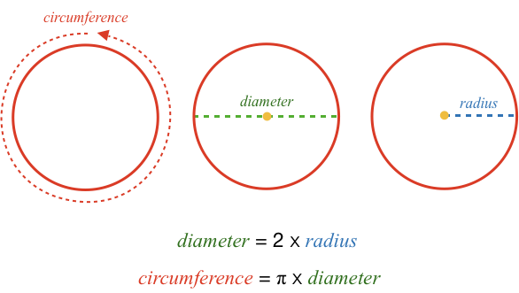

## Radius, Diameter and Circumference Example Calculations

The circle's radius, diameter and circumference are related to each other by:

### Example 1:

#### What is the _diameter_ of a circle when its radius is 1?

<!-- 
 -->
$$\definecolor{b}{RGB}{0,118,186}\definecolor{r}{RGB}{238,34,12}\definecolor{g}{RGB}{1,113,0} \color{g}diameter \color{black}= 2 \times \color{b}radius \color{black}= 2 \times 1 = \bbox[10px,border:1px solid gray]{2}$$
<!-- 
 -->

### Example 2:

#### What is the _circumference_ of a circle when its radius is 5?

<!-- 
 -->
First combine the equations for circumference, radius and diameter to find the relationship between circumference and radius:

$$\color{r}circumference \color{black}= \pi \times 2 \times \color{b}radius$$

Substitute in the radius value:

$$\color{r}circumference \color{black}= \pi \times 2 \times 5 = 10\pi$$

Substitute in the approximate value for $$\pi$$:

$$\color{r}circumference \color{black}= 10 \times 3.14 = \bbox[10px,border:1px solid gray]{31.4}$$
<!-- 
 -->

### Example 3:

#### What is the _diameter_ of a circle when its circumference is 20?

<!-- 
 -->
First rearrange the relationship between diameter and circumference:

$$\color{g}diameter \color{black}= \frac{\color{r}circumference}{\color{black}\pi}$$

Substitute in the value for circumference and $$\pi$$:

$$\color{g}diameter \color{black}= \frac{20}{3.14} = \bbox[10px,border:1px solid gray]{3.37}$$
<!-- 
 -->
