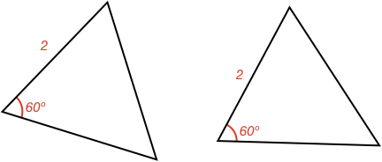
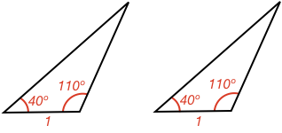
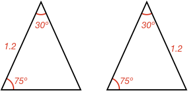
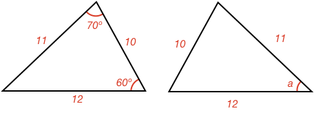
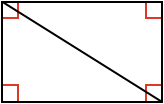

## External Angles of a Triangle Calculations

### Example 1:

#### Are these two triangles congruent?

<hintLow>[Answer]
Both triangles have the same corresponding angles and side lengths. Therefore, they are the same and congruent.

$$\bbox[10px,border:1px solid gray]{Yes}$$
</hintLow>

### Example 2:

#### Are these two triangles congruent?

<hintLow>[Answer]
Both triangles have the same corresponding angle and side, however two properties is not enough information to guarantee the triangles are congruent.

$$\bbox[10px,border:1px solid gray]{Not\ \ enough\ \ information}$$
</hintLow>

### Example 3:

#### Are these two triangles congruent?

<hintLow>[Answer]
Both triangles have the same corresponding **SAS** combination. Even though they are mirror images of each other (flipped), they will have all the same corresponding angles and sides and so they are congruent.

$$\bbox[10px,border:1px solid gray]{Yes}$$
</hintLow>

### Example 4:

#### Are these two triangles congruent?

<hintLow>[Answer]
Both triangles have the same corresponding **ASA** combination. Therefore they are congruent.

$$\bbox[10px,border:1px solid gray]{Yes}$$
</hintLow>

### Example 5:

#### Are these two triangles congruent?

<hintLow>[Answer]
As presented, the triangles have two different sets of properties. The left has **ASA** while the one on the right is **AAS**.

However, we also know the sum of angles in a [[triangle]]((qr,'Math/Geometry_1/Triangles/base/AngleSum',#00756F)) is 180º. Therefore, we can calculate the unknown angle in both triangles, and we will have four known properties in each triangle.

The unknown angle is the same for both triangles:

$$180^\circ - 75^\circ - 30^\circ = 75^\circ$$

We now have the same **ASA** property combination in both triangles and they are therefore congruent. (Note, we also have the same **AAS** combination in both triangles).

$$\bbox[10px,border:1px solid gray]{Yes}$$
</hintLow>

### Example 6:

#### What is the size of angle $$\definecolor{r}{RGB}{238,34,12}\color{r}a$$ in degrees?

<hintLow>[Answer]
Both triangles have the same side lengths, and are therefore congruent from **SSS**.

The left triangle's missing angle corresponds with angle $$\color{r}a$$, and can be calculated knowing the sum of angles in a [[triangle]]((qr,'Math/Geometry_1/Triangles/base/AngleSum',#00756F)) is 180º. Therefore

$$\color{r}a \color{black} = 180^\circ - 70^\circ - 60^\circ = \bbox[10px,border:1px solid gray]{50^\circ}$$
</hintLow>

### Example 7:

#### Are the two triangles congruent?

<hintLow>[Answer]
The larger shape is a [[rectangle]]((qr,'Math/Geometry_1/RectanglesAndSquares/base/Rectangle',#00756F)) as it has four 90º angles.

Therefore, its opposite sides are equal in length.

The two triangles share a longer side in the middle of the rectangle, and so both have the same side lengths. Therefore, they are congruent from **SSS**.

$$\definecolor{r}{RGB}{238,34,12}\bbox[10px,border:1px solid gray]{Yes}$$
</hintLow>

### Example 8:

#### What is the size of angle $$\definecolor{r}{RGB}{238,34,12}\color{r}a$$ in degrees?

<hintLow>[Answer]
Even though one of the triangles sides (the middle diagonal) doesn't have a length, both triangles share it as a side.

Therefore, we know both triangles share all the same side lengths and are congruent from **SSS**. As they are congruent, we know that the corresponding angles must also be the same.

In the top triangle, angle $$\definecolor{r}{RGB}{238,34,12}\color{r}a$$ is opposite the side with length 3. On the bottom triangle, the side with length 3 is opposite the angle 25º.

Therefore:

$$\color{r}a \color{black} = \bbox[10px,border:1px solid gray]{25^\circ}$$
</hintLow>
