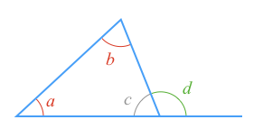

## External Angles of a Triangle

Consider a triangle with one of its sides extended beyond the corner.

An $$\definecolor{b}{RGB}{0,162,255}\definecolor{b}{RGB}{238,34,12}\definecolor{g}{RGB}{29,177,0}\definecolor{gr}{RGB}{150,150,150}\color{g}external\ angle$$ (also called $$\color{g}exterior\ angle$$) is the angle formed between the extended side and the adjacent side in the triangle.

We know the sum of the angles in a [[triangle]]((qr,'Math/Geometry_1/Triangles/base/AngleSum',#00A89D)) add to 180º:

$$\color{r}a\color{black}+\color{r}b\color{black}+\color{gr}c\color{black}=180^\circ$$

Angles $$\color{gr}c$$ and $$\color{g}d$$ are [[supplementary]]((qr,'Math/Geometry_1/AdjacentAngles/base/Supplementary',#00A89D)), and also add to 180º:

$$\color{gr}c\color{black}+\color{g}d\color{black}=180^\circ$$

As both equation equal 180º, then they can be combined:

$$\color{r}a\color{black}+\color{r}b\color{black}+\color{gr}c\color{black}=\color{gr}c\color{black}+\color{g}d$$

Therefore:

$$\bbox[20px,border:1px solid red]{\color{r}a\color{black}+\color{r}b\color{black}\color{black}=\color{g}d}$$

So the external angle of a triangle is equal to the sum of the two opposite interior angles.

A triangle can have up to **six** exterior angles:

