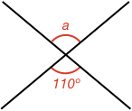
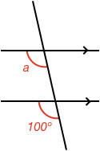
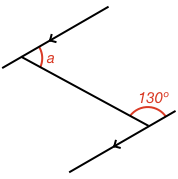
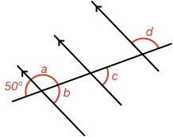
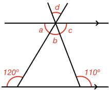

## Calculation using Intersection Angles

### Example 1:

#### What is the size of angle $$\definecolor{r}{RGB}{238,34,12}\color{r}a$$ in degrees?

In this example, the angles are **opposite** angles, and therefore equal. Therefore:

$$\color{r}a\color{black} = \bbox[10px,border:1px solid gray]{110^\circ}$$

### Example 2:

#### What is the size of angle $$\definecolor{r}{RGB}{238,34,12}\color{r}a$$ in degrees?

In this example, the angles are **alternate** angles, and therefore equal. Therefore:

$$\color{r}a\color{black} = \bbox[10px,border:1px solid gray]{70^\circ}$$

### Example 3:

#### What is the size of angle $$\definecolor{r}{RGB}{238,34,12}\color{r}a$$ in degrees?

In this example, the angles are **corresponding** angles, and therefore equal. Therefore:

$$\color{r}a\color{black} = \bbox[10px,border:1px solid gray]{100^\circ}$$

### Example 4:

#### What is the size of angle $$\definecolor{r}{RGB}{238,34,12}\color{r}a$$ in degrees?

In this example, the angles are **interior** angles, and therefore add to 180º. Therefore:

$$\color{r}a\color{black} = 180^\circ - 130^\circ = \bbox[10px,border:1px solid gray]{50^\circ}$$

### Example 5:

#### What is the size of angles $$\definecolor{r}{RGB}{238,34,12}\color{r}c$$ and $$\color{r}d$$ in degrees?

To calculate angles $$\color{r}c$$ and $$\color{r}d$$ we first need to find angles $$\color{r}a$$ and $$\color{r}b$$.

Angle $$\color{r}a$$ is a supplementary angle with $$\color{r}50^\circ$$, and so it is:

$$\color{r}a \color{black} = 180^\circ - 50^\circ = 130^\circ$$

Angles $$\color{r}a$$ and $$\color{r}d$$ are corresponding angles and are therefore equal:

$$\color{r}d \color{black} = \color{r}a \color{black} = \bbox[10px,border:1px solid gray]{130^\circ}$$

Angle $$\color{r}b$$ is an opposite angle to $$\color{r}50^\circ$$, and so it is equal:

$$\color{r}b \color{black} = 50^\circ$$

Angles $$\color{r}b$$ and $$\color{r}c$$ are corresponding angles and are therefore equal:

$$\color{r}c \color{black} = \color{r}b \color{black} = \bbox[10px,border:1px solid gray]{50^\circ}$$

### Example 6:

#### What is the size of angle $$\definecolor{r}{RGB}{238,34,12}\color{r}d$$ in degrees?

First we recognize that angles $$\color{r}a$$ and $$\color{r}120^\circ$$ are interior angles and therefore add to 180º:

$$\color{r}a \color{black} = 180^\circ - 120^\circ = 60^\circ$$

Similarly, angles $$\color{r}c$$ and $$\color{r}110^\circ$$ are interior angles:

$$\color{r}c \color{black} = 180^\circ - 110^\circ = 70^\circ$$

We can also see that angles $$\color{r}a$$, $$\color{r}b$$ and $$\color{r}c$$ are supplementary angles:

$$\color{r}b \color{black}=180^\circ - \color{r}a \color{black} - \color{r}c \color{black}= 50^\circ$$

Finally, angles $$\color{r}b$$ and $$\color{r}d$$ are opposite, and therefore equal:

$$\color{r}d \color{black} = \color{r}b \color{black} = \bbox[10px,border:1px solid gray]{50^\circ}$$
