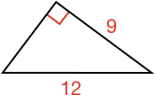
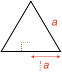

## Right Angle Triangle Example Calculations

### Example 1:

#### What is the length of side $$\definecolor{r}{RGB}{238,34,12}\color{r}a$$?

<hintLow>[Answer]
The square of the hypotenuse of a right angle triangle is the sum of the squares of the other two sides. Therefore:

$$\color{r}a^2\color{black} = 3^2 + 4^2 = 25$$

$$\color{r}a\color{black} = \bbox[10px,border:1px solid gray]{5}$$
</hintLow>

### Example 2:

#### What is the area of the triangle below?

<hintLow>[Answer]
Area of a right angle triangle is the product of its two perpendicular sides, but one of the perpendicular sides is unknown (we will call it $$\color{r}a$$). Therefore, the unknown side length is:

$$12^2 = 9^2 + \color{r}a^2\color{black}$$

$$\color{r}a\color{black} = 7.93$$

Therefore, the area is:

$$Area = \textstyle{\frac{1}{2}}\times 7.93 \times 9 =  \bbox[10px,border:1px solid gray]{35.71}$$

</hintLow>

### Example 3:

#### What is length of the diagonal $$\color{r}a$$ of the square?

<hintLow>[Answer]

The diagonal and two adjacent sides of the square make a right angle triangle.

Therefore, using the Pythagorean Theorem, we can calculate the diagonal:

$$\color{r}a\color{black} = \sqrt{(1 + 1)} = \bbox[10px,border:1px solid gray]{1.41}$$

</hintLow>

### Example 4:

#### What is the area of an equilateral triangle of side $$\color{r}a$$?

<hintLow>[Answer]

An equilateral triangle is a special form of an [[isosceles]]((qr,'Math/Geometry_1/Isosceles/base/Main',#00756F)) triangle.

When you [[split]]((qr,'Math/Geometry_1/Isosceles/base/SplitLine',#00756F)) an isosceles triangle into two equal halves, the split line forms a right angle with the base.

Therefore we have: 

The height of the triangle can be calculated using the Pythagorean Theorem:

$$height = \sqrt{\color{r}a\color{black}^2 - \left(\textstyle{\frac{1}{2}}\color{r}a\color{black}\right)^2}$$

$$height = \sqrt{\textstyle{\frac{3}{4}}\color{r}a\color{black}^2} = \textstyle{\frac{\sqrt{3}}{2}}\color{r}a\color{black}$$

The area of the equilateral triangle is then:

$$Area = \textstyle{\frac{1}{2}} \color{r}a\color{black} \times \textstyle{\frac{\sqrt{3}}{2}}\color{r}a\color{black} = \bbox[10px,border:1px solid gray]{\textstyle{\frac{\sqrt{3}}{4}} \color{r}a\color{black}^2}$$

</hintLow>

<!-- 

<hintLow>[Answer]
[[triangle]]((qr,'Math/Geometry_1/Triangles/base/AngleSum',#00756F)) 
</hintLow>

 $$\bbox[10px,border:1px solid gray]{Yes}$$ -->