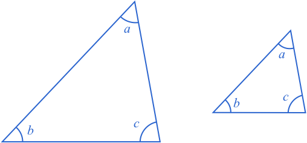
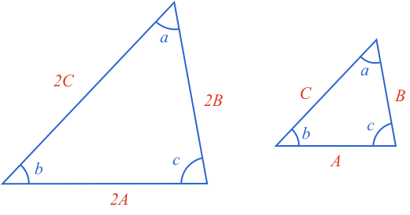
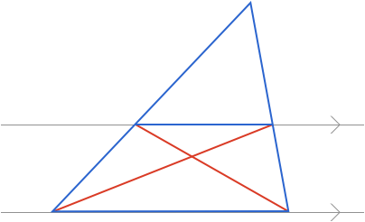
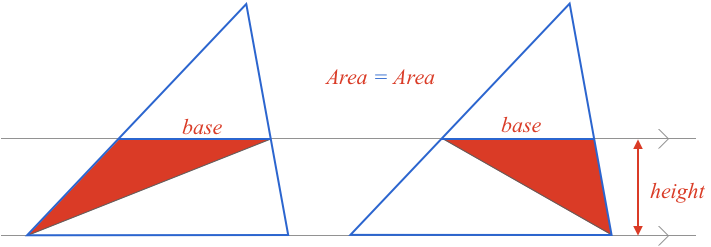
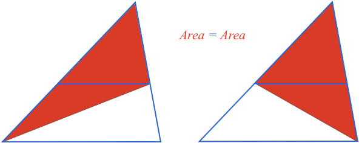
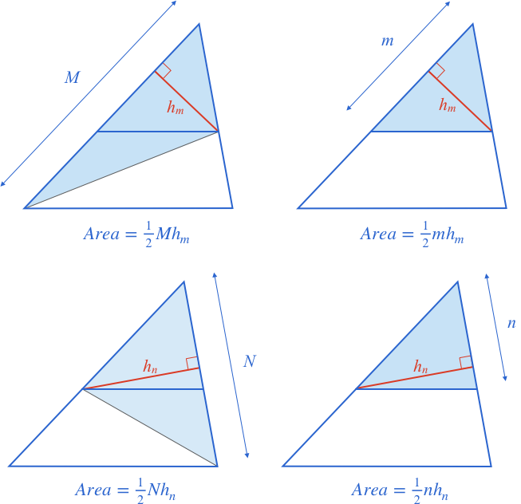

## Similar Triangles

Similar shapes are those that have the same shape but are a different size.

Similar triangles are triangles that have the same angles, and whose corresponding sides are proportional.

### Equiangular Triangles are Similar - Proof

Two triangles that have the same angles can be different sizes.

However, while the sizes may be different, the sizes are still related. Specifically, all pair of corresponding sides have the same ratio.

This means, if the side of the larger triangle between angles $$\definecolor{b}{RGB}{0,103,214}\definecolor{g}{RGB}{29,177,0}\definecolor{g}{RGB}{238,34,12}\color{b}a$$ and $$\color{b}b$$ is double the length of the corresponding side of the smaller triangle, then the other sides of the larger triangle will also be double the length of their corresponding sides on the smaller triangle.

In other words, each side of one triangle is the same proportion of each relative side of the second triangle.

We can prove this by overlaying one triangle on the other.

The first observation we can make is the two $$\color{b}b$$ angles are **equal** and [[corresponding angles]]((qr,'Math/Geometry_1/RelatedAngles/base/Corresponding',#00756F)). This means the two horizontal lines are **parallel**.

Next, we draw diagonals in the lower quadrilateral.

Now, we know the [[distance]]((qr,'Math/Geometry_1/ParallelLineDistance/base/Main',#00756F)) between two parallel lines is the length of the perpendicular line between them. Therefore, two of the new triangles we have formed have the same [[area]]((qr,'Math/Geometry_1/AreaTriangle/base/Main',#00756F)) as they share the same **height** (distance between parallel lines) and **base** side.

As these two triangles have equal area, then when they are added to the same top triangle, their sum must also have equal area.

We now draw in the height of these triangles. Note, the height we’ve chosen can also be used as the height of the smaller top triangle.

Let's now consider all four combinations of triangle areas:

We know the **larger two triangles** have the same area:

$$\color{b}\textstyle{\frac{1}{2}}Mh_m = \textstyle{\frac{1}{2}}Nh_n$$

Which we can rearrange to:

$$\color{b}\frac{M}{N}=\frac{h_n}{h_m} \ \ \ \ \ \ \ \ \color{grey}(1)$$

We also know the **smaller area** can be calculated using either $$\color{b}m$$ or $$\color{b}n$$:

$$\color{b}\textstyle{\frac{1}{2}}mh_m = \textstyle{\frac{1}{2}}nh_n$$

Which we can rearrange to:

$$\color{b}\frac{m}{n}=\frac{h_n}{h_m} \ \ \ \ \ \ \ \ \color{grey}(2)$$

Therefore as both $$\color{grey}(1)$$ and $$\color{grey}(2)$$ equal the same ratio of $$\color{b}h_n$$ and $$\color{b}h_m$$:

$$\color{b}\frac{m}{n}=\frac{M}{N}$$

In other words, the ratio of the small triangle side n to its corresponding side N on the large triangle, is the same as the ratio of the small triangle side m to its corresponding side M on the larger triangle.

