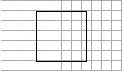
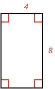
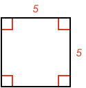
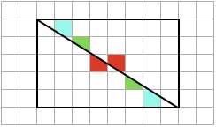

### Example 1:

What is the area of this shape?

<hintLow>[Answer]
The area is the number of squares in the shape. Here we need to be careful as there are a number of half squares to count. Therefore the area is:

$$\bbox[10px,border:1px solid gray]{25}$$
</hintLow>

### Example 2:

What is the area of this shape?

<hintLow>[Answer]
The shape is a rectangle, and so its area is the product of its side lengths.

$$area=4 \times 8 = \bbox[10px,border:1px solid gray]{32}$$
</hintLow>

### Example 3:

What is the area of this shape?

<hintLow>[Answer]
The shape is a square, and so its area is the square of its side length.

$$area=5 \times 5 = \bbox[10px,border:1px solid gray]{25}$$
</hintLow>

### Example 4:

What is the total area of these shapes?

<hintLow>[Answer]
The total shape consists of a rectangle of $$15 \times 8$$ and a square of $$10 \times 10$$. Therefore, the area is the sum of both:

$$area=120 + 100 = \bbox[10px,border:1px solid gray]{200}$$
</hintLow>

### Example 5:

What is the side length of this square?

<hintLow>[Answer]
The area of a square is the square of the side length, therefore, therefore the side length will be the square root of the area.

$$side\ \ length=\sqrt{16} = \bbox[10px,border:1px solid gray]{4}$$
</hintLow>

### Example 6:

What is the area of one of the triangles?

<hintLow>[Answer]
Counting the squares is a little challenging as there are lots of portions of squares. However, we might notice a pattern that helps with our calculation.

Each triangle seems to have the same corresponding square portions. Some examples are colored below:

If we do a sum of all portions of squares in each triangle we see they are the same.

Therefore, the area is half the area of the larger rectangle:

$$area= \textstyle\frac{1}{2} 5 \times 8 = \bbox[10px,border:1px solid gray]{20}$$
</hintLow>