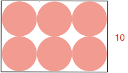

## Title

### Example 1:

#### What is the area of of the circle below?

<hintLow>[Answer]
The area of a circle is the product of [[π]]((qr,'Math/Geometry_1/Circle/base/Pi',#00756F)) and the [[radius]]((qr,'Math/Geometry_1/Circle/base/Radius',#00756F))  squared. Therefore:

$$Area = \pi \times 5^2 = \bbox[10px,border:1px solid gray]{78.5}$$ 
</hintLow>

### Example 2:

#### What is the diamter of the circle below?

<hintLow>[Answer]
Rearrange the area equation to give radius:

$$r = \sqrt{\frac{Area}{\pi}}$$

And [[diameter]]((qr,'Math/Geometry_1/Circle/base/Diameter',#00756F)) is twice the radius. Therefore:

$$Area = 2 \times \sqrt{\frac{5}{\pi}} = \bbox[10px,border:1px solid gray]{2.5}$$ 
</hintLow>

### Example 3:

#### What is the area of the 6 cirles enclosed in the rectangle below?

<hintLow>[Answer]

As there are 2 circles within the rectangle height of 10, then each circle has a diameter of 5.

Therefore the area of the circles is:

$$Area = 6 \times \pi \times \left( \frac{5}{2}^2 \right) = \bbox[10px,border:1px solid gray]{117.8}$$ 

</hintLow>

### Example 4:

#### What is the area of the shaded shape?

<hintLow>[Answer]

The shaded area is the difference in areas of the larger and smaller circle.

Therefore:

$$Area = \pi \times 5 ^ 2 - \pi \times 2.5^2 = \bbox[10px,border:1px solid gray]{58.9}$$ 

</hintLow>

### Example 5:

##### How many square millimeters are in a square meter?

<hintLow>[Answer]

There are 1000 millimeters (mm) in 1 meter (m).

Therefore if we have a square of side length 1m, you could also say its side length is 1000mm.

$$Area = 1000\ mm \times 1000\ mm = \bbox[10px,border:1px solid gray]{1,000,000\ mm^2}$$

So there are one million square millimeters in a square meter.

</hintLow>