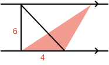

### Example 1

What is distance between the parallel lines?

<hintLow>[Answer]
  The distance between the parallel lines is the width (diameter) of the circle.

  The circle's radius is 2, therefore the diameter is 4:

  $$distance = \bbox[10px,border:1px solid gray]{4}$$
</hintLow>

### Example 2

What is the area of the red triangle?

<hintLow>[Answer]
  The distance between parallel lines is constant. Therefore both triangles have the same height.

  As both triangles also share the same base, then their areas are the same. Therefore:

  $$Area = \textstyle{\frac{1}{2}}\times 6 \times 4 = \bbox[10px,border:1px solid gray]{12}$$

</hintLow>

<!-- [[triangle]]((qr,'Math/Geometry_1/Triangles/base/AngleSum',#00756F)) 
 $$\bbox[10px,border:1px solid gray]{Yes}$$ -->