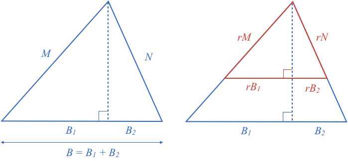
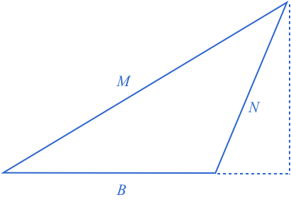
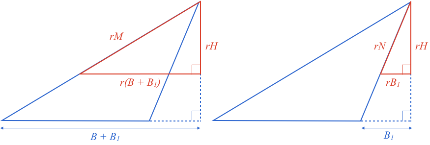
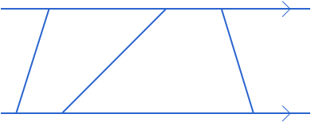
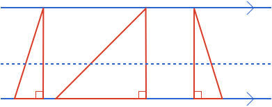
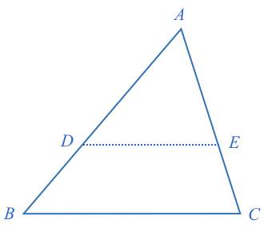
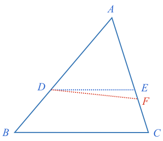

### Right Angle Triangle Split

Start with a [[right angle triangle]]((qr,'Math/Geometry_1/RightAngleTriangles/base/Definition',#00756F)) with sides $$\definecolor{b}{RGB}{0,118,186}\definecolor{r}{RGB}{238,34,12}\color{b}M$$, $$\color{b}N$$ and $$\color{b}B$$ (figure left). A line [[parallel]]((qr,'Math/Geometry_1/ParallelLines/base/Main',#00756F)) to $$\color{b}B$$ is used to split the triangle, and form a new triangle with sides $$\color{r}m$$, $$\color{r}n$$, $$\color{r}b$$ (figure middle). This new triangle is also a right angle triangle as $$\color{b}b$$ and $$\color{b}B$$ are parallel and the new triangle's right angle is a [[corresponding angle]]((qr,'Math/Geometry_1/AnglesAtIntersections/base/Corresponding',#00756F)) with the original’s right angle. We then create a third triangle and add the [[areas]]((qr,'Math/Geometry_1/AreaTriangle/base/Main',#00756F)) of the three triangles to get the original triangle’s area (figure right).

$$Area_{MNB} = Area_1 + Area_2 + Area_3$$

$$\textstyle\frac{1}{2}BN = \textstyle\frac{1}{2}B(N-n) + \textstyle\frac{1}{2}b(N-n) + \textstyle\frac{1}{2}bn$$

Which simplifies down to:

$$Bn = bN$$

Or:

$$\frac{b}{B} = \frac{n}{N} \ \ \ \ \ \ \ \ \color{grey}(1)$$

This says the ratio of sides $$\color{b}b$$ and $$\color{b}B$$, and sides $$\color{b}n$$ and $$\color{b}N$$ is the same, which we will call $$\color{b}r$$. We can then rearrange $$\color{grey}(1)$$ to show that both $$\color{b}b$$ and $$\color{b}n$$ have been scaled from $$\color{b}B$$ and $$\color{b}N$$ by the same multiplier $$\color{b}r$$:

$$b = \frac{n}{N}B = rB \ \ \ \ \ \ \ \ \color{grey}(2)$$

$$n = \frac{b}{B}N = rN \ \ \ \ \ \ \ \ \color{grey}(3)$$

Now, the [[Pythagorean theorem]]((qr,'Math/Geometry_1/RightAngleTriangles/base/Pythagorus',#00756F)) for the large triangle is:

$$M^2 = B ^ 2 + N ^ 2 \ \ \ \ \ \ \ \ \color{grey}(4)$$

and for the small triangle is:

$$m^2 = b ^ 2 + n ^ 2 \ \ \ \ \ \ \ \ \color{grey}(5)$$

Substituting in $$\color{grey}(2)$$, $$\color{grey}(3)$$ into $$\color{grey}(5)$$:

$$m^2 = r^2B ^ 2 + r^2N ^ 2$$

$$m^2 = r^2(B ^ 2 + N ^ 2) \ \ \ \ \ \ \ \ \color{grey}(6)$$

Substituting $$\color{grey}(4)$$ into $$\color{grey}(6)$$:

$$m^2 = r^2M^2$$

$$\therefore m = rM$$

And so the third side of the split triangle is also reduced by the same factor as the other two sides.

$$\frac{b}{B} = \frac{n}{N} = \frac{m}{M} $$

**So, if a right angle triangle is split with a line parallel to one of its perpendicular sides, then the new split triangle's sides are all in equal proportion to their corresponding sides of the original triangle.**

A right angle triangle is a simple case that can be extended to different scenarios.

### Split Triangle

Lets now split an arbitrary triangle with a line parallel to one of the sides.

Any triangle is just the sum or difference of two right angle triangles. The sum case is highlighted in the below figure, where on the left a triangle is split into two right angle triangles. The two right angle triangles share the same height, so a split with a  line parallel to the base will split all lines of both triangles with the same ratio $$\color{r}r$$.

Recombining the base of the split triangle shows its side is:

$$rB_1 + rB_2 = r(B_1 + B_2) = rB$$

And so all sides of the new triangle have been reduced by the same ratio from their original corresponding sides.

The same process can be done with a triangle that is formed with the difference of two right angle triangles.

<!--  -->

Here the base of the smaller triangle is:

$$r\left(B + B_1\right) - rB_1 = rB$$

So we find **if any triangle is split with a line parallel to one of its sides, then the new split triangle's sides are all in equal proportion to their corresponding sides of the original triangle**.

### Lines between Parallel Lines

Another scenario is when there are multiple lines between parallel lines. This is the same as saying there are multiple lines with the same height as the [[distance]]((qr,'Math/Geometry_1/ParallelLineDistance/base/Main',#00756F)) between parallel lines is constant:

If we introduce a third parallel line, then all lines between the parallel lines will be split with the same ratio. We can show this by making each line between the parallel lines the hypotenuse of a right angle triangle.

As each triangle has the same height, then any parallel split line will split all the hypotenuses by the same proportion.

**Therefore, when lines between parallel lines are split by a third parallel line, they are all split with the same ratio.**

### Line Formed by Two Sides Split in Proportion

When a triangle is split by a parallel line, the split triangle’s sides all have the same proportion, or ratio, to the original triangle’s sides.

Is the converse true? If we draw a line between two sides of a triangle split in the same ratio, is that line parallel?

First, take a triangle and split two of it’s sides in the same ratio:

Here the sides $$\color{b}AB$$ and $$\color{b}AC$$ are split by $$\color{b}D$$ and $$\color{b}E$$ respectively such that:

$$\frac{\color{b}AD}{\color{b}AB}\color{black} = \frac{\color{b}AE}{\color{b}AC} \ \ \ \ \ \ \ \ \color{grey}(1)$$

Now let’s assume that DE is NOT parallel with $$\color{b}AC$$. Therefore, draw a line from $$\color{b}D$$ that is parallel with $$\color{b}AC$$. This line is $$\color{b}DF$$.

Now, as $$\color{b}D\color{r}F$$ is parallel to $$\color{b}BC$$, we know from above that the line must split $$\color{b}AB$$ and $$\color{b}AC$$ in proportion:

$$\frac{\color{b}AD}{\color{b}AB}\color{black} = \frac{\color{r}AF}{\color{b}AC} \ \ \ \ \ \ \ \ \color{grey}(2)$$

Equations $$\color{grey}(1)$$ and $$\color{grey}(2)$$ have the same left side term, and therefore equal each other:

$$\frac{\color{b}AE}{\color{b}AC}\color{black} = \frac{\color{r}AF}{\color{b}AC}$$

Which simplifies to:

$$\color{b}AE\color{black} = \color{r}AF$$

Therefore $$\color{b}E$$ and $$\color{r}F$$ must be the same point. As $$\color{b}D\color{r}F$$ is parallel with $$\color{b}AC$$, then so $$\color{b}DE$$ must also be parallel.

**Therefore, if we draw a line between two sides of a triangle split by the same proportion or ratio, that line will be parallel to the third side.**
