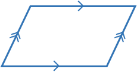
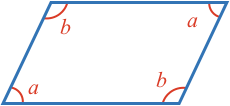
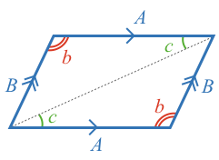
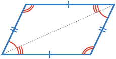
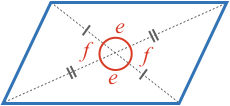
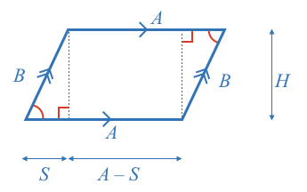

### Definition

A **parallelogram** is a shape with four sides ([[quadrangle or quadrilateral]]((qr,'Math/Geometry_1/Quadrangles/base/Main',#00756F)))  that has **parallel opposite sides**.

On this page you will discover some of the properties of a parallelogram. You will also investigate the converse relationships of these properties to determine if they can be used to identify a parallelogram.

It is useful to progress through these in order as the earlier properties are sometimes needed for the later properties.

* [Opposite Angles](#angles)
* [Opposite Angles - Converse](#angles-converse)
* [Opposite Sides](#sides)
* [Opposite Sides - Converse](#sides-converse)
* [Diagonal Intersection](#diagonals)
* [Diagonal Intersection - Converse](#diagonals-converse)
* [Area](#area)

### Angles 

Can you find a relationship between the angles of a parallelogram?

<hint>You can use [[interior angles between parallel lines]]((qr,'Math/Geometry_1/AnglesAtIntersections/base/Interior',#00756F)).</hint>

<hint>Is there a relationship between opposite angles?</hint>

<hintLow>[Answer]

Consider the four angles of a parallelogram.

As opposite sides are parallel, then all adjacent [[interior angles]]((qr,'Math/Geometry_1/AnglesAtIntersections/base/Interior',#00756F)) must sum to 180º.

$$\definecolor{g}{RGB}{29,177,0}\definecolor{b}{RGB}{0,118,186}\definecolor{r}{RGB}{238,34,12}\color{r}b\color{black}=180^\circ-\color{r}a$$

$$\color{r}b\color{black}=180^\circ-\color{r}c$$

$$\color{r}d\color{black}=180^\circ-\color{r}a$$

Thus:

$$\color{r}b\color{black}=\color{r}d$$ and $$\color{r}a\color{black}=\color{r}c$$

**A parallelogram's opposite angles are equal**.
</hintLow>

### Angles - Converse 

Consider any quadrangle with the angle relationship of a parallelogram. Is the quadrangle a parallelogram?

<hint>A quadrangle's angles always [[add to 360º]]((qr,'Math/Geometry_1/Quadrangles/base/Main',#00756F)).</hint>

<hint>When [[interior angles]]((qr,'Math/Geometry_1/AnglesAtIntersections/base/Interior',#00756F)) of two intersected lines equal 180º, then the lines must be parallel.</hint>

<hintLow>[Answer]
Consider a quadrangle with equal opposite angles

A quadrangle's angles always [[add to 360º]]((qr,'Math/Geometry_1/Quadrangles/base/Main',#00756F)).

$$360^\circ = 2\color{r}a \color{black}+ 2\color{r}b$$

Thus: $$180^\circ = \color{r}a \color{black}+ \color{r}b$$

When [[interior angles]]((qr,'Math/Geometry_1/AnglesAtIntersections/base/Interior',#00756F)) of two intersected lines equal 180º, then the lines must be parallel.

**Any quadrangle with equal opposite angles is a parallelogram.**

</hintLow>

### Opposite Sides 

Can you find a relationship between the side lengths of a parallelogram?

<hint>Draw a diagonal between two opposite corners of the parallogram</hint>

<hint>Use [[alternalte angles between parallel lines]]((qr,'Math/Geometry_1/AnglesAtIntersections/base/Alternate',#00756F)) to highlight a pair of equal angles.</hint>

<hint>Use [[AAS]]((qr,'Math/Geometry_1/CongruentTriangles/base/Aas',#00756F)) to show two triangles are congruent.</hint>

<hintLow>[Answer]
Consider a parallelogram with equal opposite angles $$\color{r}b$$, a diagonal, and marked angles $$\color{g}c$$ and $$\color{g}d$$.

Angles $$\color{g}c$$ and $$\color{g}d$$ are [[alternalte angles between parallel lines]]((qr,'Math/Geometry_1/AnglesAtIntersections/base/Alternate',#00756F)). Therefore:

$$\color{g}c \color{black}= \color{g}d$$

Both triangles formed by the diagonal are congruent by [[AAS]]((qr,'Math/Geometry_1/CongruentTriangles/base/Aas',#00756F)) (angles $$\color{r}b$$, $$\color{g}c$$ and the diagonal).

So the triangle's corresponding sides are equal.

**Therefore a parallelogram's opposite sides are equal.**
</hintLow>

### Opposite Sides - Converse 

Consider any quadrangle with the side relationship of a parallelogram. Is the quadrangle a parallelogram?

<hint>Use a diagonal between one pair of opposite corners of a quadrangle with equal opposite sides.</hint>

<hint>Are the triangles formed by the diagonal congruent?</hint>

<hint>Use the [[SSS]]((qr,'Math/Geometry_1/CongruentTriangles/base/Sss',#00756F)) congruency test.</hint>

<hint>What is the implication for the angles of the two triangles?</hint>

<hintLow>[Answer]
Consider a quadrangle with equal opposite sides and marked diagonal.

By [[SSS]]((qr,'Math/Geometry_1/CongruentTriangles/base/Sss',#00756F)) the two triangles are congruent.

Therefore corresponding triangle angles are equal.

Therefore the quadrangle's opposite angles are equal, and the shape must be a parallelogram.

**Any quadrangle with equal opposite sides is a parallelogram.**
</hintLow>

### Diagonals 

Can you find a property of a parallelogram's diagonals?

<hint>Two diagonals will create four triangles. Are any of the triangles congruent?</hint>

<hint>Try finding which angles in the four triangles are equal. You only need to find a few pairs.</hint>

<hint>Experiment with [[opposite angles]]((qr,'Math/Geometry_1/AnglesAtIntersections/base/Opposite',#00756F)), and [[alternate angles]]((qr,'Math/Geometry_1/AnglesAtIntersections/base/Alternate',#00756F)).</hint>

<hintLow>[Answer]

Consider a parallelogram with marked diagonals forming four internal triangles, equal sides $$\color{b}A$$, equal angles $$\color{g}c$$, and equal angles $$\color{r}e$$.

We showed angles $$\color{g}c$$ are equal in [Opposite Sides](#sides).

Angles $$\color{r}e$$ are equal as they are [[opposite angles]]((qr,'Math/Geometry_1/AnglesAtIntersections/base/Opposite',#00756F)).

The top and bottom internal triangles (unshaded) are congruent by [[AAS]]((qr,'Math/Geometry_1/CongruentTriangles/base/Aas',#00756F)) ($$\color{r}e$$, $$\color{g}c$$, $$\color{b}A$$).

Mark in the congruent sides:

So we can see the diagonals are each split in half.

**Parallelograms have diagonals that intersect at their mid points.**

</hintLow>

### Diagonals - Converse 

Consider any quadrangle with two diagonals that have a relationship of a parallelogram. Is the quadrangle a parallelogram?

<hint>Consider a quadrangle with diagonal lines that intersect at their midpoints. You have four triangles, of which you know two sides of each. Can you find an angle or third side that allows you to see which triangles are congruent?</hint>

<hint>You can find an angle using [[opposite angles]]((qr,'Math/Geometry_1/AnglesAtIntersections/base/Opposite',#00756F)).</hint>

<hint>[[SAS]]((qr,'Math/Geometry_1/CongruentTriangles/base/Sas',#00756F)) can be used to show congruence.</hint>

<hint>We've already seen above that any quadrangles with equal opposite angles, or equal opposite sides is a parallelogram.</hint>

<hintLow>[Answer]
Consider a quadrangle with diagnols that intersect at their midpoints. At the intersection, there are two pair of [[equal opposite angles]]((qr,'Math/Geometry_1/AnglesAtIntersections/base/Opposite',#00756F)), labled $$\color{r}e$$ and $$\color{r}f$$.

By [[SAS]]((qr,'Math/Geometry_1/CongruentTriangles/base/Sas',#00756F)) the top and bottom triangles are congruent. Therefore the top side and bottom side have equal length.

Similarly the left and right triangles are congruent, and the left and right sides have equal length.

Thus we have a quadrangle with opposite sides of equal length, which is a parallelogram.

**Any quadrangle with diagonals that intersect at their midpoints will be a paralleogram.**

</hintLow>

### Area 

Can you find an expression for the area of a parallelogram?

<hint>Try splitting the parallogram into a rectangle and two right angle triangles.</hint>

<hint>Are the right angle triangles congruent?</hint>

<hint>The area is a function of the height of the parallelogram (the distance between one pair of parallel lines).</hint>

<hintLow>[Answer]
Consider a parallelogram that has been split into a rectangle and two right angle triangles.

By [[AAS]]((qr,'Math/Geometry_1/CongruentTriangles/base/Aas',#00756F)), the right angle triangles are congruent.

Therefore, their side length $$\color{b}S$$ along the parallelogram side $$\color{b}A$$ is the same.

The area of the parallelogram is the sum:

$$\color{b}Area \color{black}= \color{b}Area_{rectangle} \color{black}+ 2\color{b}Area_{triangle}$$

$$\color{b}Area \color{black}= (\color{b}A \color{black}- \color{b}S\color{black})\color{b}H \color{black}+ 2\times \frac{1}{2}\color{b}SH$$

$$\color{b}Area \color{black}= \color{b}AH$$

**The area of a parallelogram is the product of a side length and the height of the parallelogram from that side.**

</hintLow>
