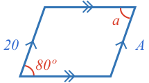
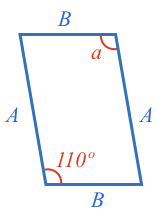

### Example 1

What is the size of angle $$\definecolor{g}{RGB}{29,177,0}\definecolor{b}{RGB}{0,118,186}\definecolor{r}{RGB}{238,34,12}\color{r}{a}$$ and side $$\color{b}A$$?

<hintLow>[Answer]
A quadrangle with parallel opposite sides is a parallelogram. A parallelogram has the properties of:

* Equal opposite angles
* Equal opposite side lengths

Therefore:

$$\color{r}a \color{black}= \bbox[10px,border:1px solid gray]{\color{r}80^\circ}$$

$$\color{b}A \color{black}= \bbox[10px,border:1px solid gray]{\color{b}20}$$
</hintLow>

### Example 2
What is the size of angle $$\color{r}{a}$$?

<hintLow>[Answer]
Any quadrangle that has equal opposite sides is a parallelogram.

A parallelogram has equal opposite angles. Therefore:

$$\color{r}a \color{black}= \bbox[10px,border:1px solid gray]{\color{r}110^\circ}$$
</hintLow>

### Example 3
What is the size of side $$\color{b}{A}$$?

<hintLow>[Answer]

Any quadrangle that has equal opposite angles is a parallelogram.

A parallelogram has equal opposite side lengths. Therefore:

$$\color{b}A \color{black}= \bbox[10px,border:1px solid gray]{\color{b}3}$$

</hintLow>

### Example 4
What is the size of side $$\color{b}{A}$$?

<hintLow>[Answer]

Any quadrangle that has diagonals that intersect at their midpoint is a parallelogram.

A parallelogram has equal opposite side lengths. Therefore:

$$\color{b}A \color{black}= \bbox[10px,border:1px solid gray]{\color{b}5}$$

</hintLow>

### Example 5
What is the area of the shape?

<hintLow>[Answer]

Any quadrangle that has equal opposite angles is a parallelogram.

A parallelogram's area is the product of one of it's sides and the distance between that side and its opposite.

$$\color{b}Area \color{black}= \color{b}A \color{black} \times \color{b}C \color{black} = \bbox[10px,border:1px solid gray]{\color{b}5}$$

In this case, $$\color{b}B$$ is unneeded information.
</hintLow>
