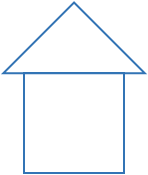
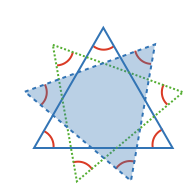
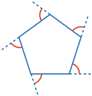

### Example 1

What is the sum of the internal angles of this shape?

<hintLow>[Answer]
An n-sided polygon's internal angles sum to:

$$\definecolor{r}{RGB}{238,34,12}\definecolor{b}{RGB}{0,118,186}total\ angle = \left(\color{b}n\color{black}-2\right) \times 180^\circ$$

This is a 5 sided shape, therefore the total angle is:

$$\bbox[10px,border:1px solid gray]{total\ angle = \left(5 - 2\right) \times 180^\circ = 540^\circ}$$
</hintLow>

### Example 2

A shape’s interior angles sum to 1440º. How many sides does it have?

<hintLow>[Answer]

We know for an n-sided polygon:

$$total\ angle = \left(\color{b}n\color{black}-2\right) \times 180^\circ$$

which we can rearrange to:

$$\color{b}n \color{black} = \frac{total\ angle}{180^\circ} + 2$$

and so the answer is:

$$\bbox[10px,border:1px solid gray]{sides = \frac{1440}{180} + 2 = 10^\circ}$$

</hintLow>

### Example 3

A triangle and square combine to make a shape. What is the sum of the internal angles of the combined shape?

<hintLow>[Answer]
The outline of the shape has 7 sides.

Therefore, the answer is:

$$\bbox[10px,border:1px solid gray]{total\ angle = \left(7 - 2\right) \times 180^\circ = 900^\circ}$$

</hintLow>

### Example 4

What is the sum of the internal angles of this star?

<hintLow>[Answer]
This star is a 9 pointed star, which means it's an 18 sided polygon.

$$\bbox[10px,border:1px solid gray]{total\ angle = \left(18 - 2\right) \times 180^\circ = 2880^\circ}$$
</hintLow>

### Example 5
What is the sum of the angles in the tips of the star?

<hintLow>[Answer]

First we can recognize that the star is actually made up of 3 triangles.

The star's tips are only made up of these 3 triangle's corners, then we can say the answer is:

$$\bbox[10px,border:1px solid gray]{tips\ total\ angle = 3 \times 180^\circ = 540^\circ}$$

</hintLow>

### Example 6

What is the sum of the external angles of this shape?

<hintLow>[Answer]
Each external angle is a [[supplementary angle]]((qr,'Math/Geometry_1/AngleGroups/base/Supplementary',#00756F)).

Therefore the sum of the external angles, is a sum of all the supplementary angles of each internal angle.

If we call the internal angles in this shape $$\color{r}a$$, $$\color{r}b$$, $$\color{r}c$$, $$\color{r}d$$ and $$\color{r}e$$, then we can say the external angle sum is:

$$external\ angle\ sum = 180^\circ - \color{r}a\color{black} + 180^\circ - \color{r}b\color{black} + 180^\circ - \color{r}c\color{black} + 180^\circ - \color{r}d\color{black} + 180^\circ - \color{r}e\color{black}$$

$$external\ angle\ sum = 5\times180^\circ - \color{r}a\color{black} - \color{r}b\color{black} - \color{r}c\color{black} - \color{r}d\color{black} - \color{r}e\color{black}$$

$$external\ angle\ sum = 5\times180^\circ - \left( \color{r}a\color{black} + \color{r}b\color{black} + \color{r}c\color{black} + \color{r}d\color{black} + \color{r}e\color{black} \right)$$

$$external\ angle\ sum = 5\times180^\circ - internal\ angle\ sum$$

The internal angle sum for a 5 sided polygon is 540º, and thus:

$$\bbox[10px,border:1px solid gray]{external\ angle\ sum = 360^\circ}$$

</hintLow>
