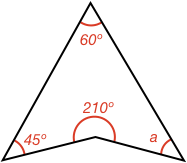
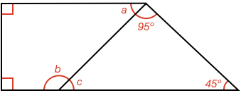

### Example 1

What is the size of angle $$\definecolor{r}{RGB}{238,34,12}\color{r}a$$ in degrees?

<hintLow>[Answer]
A quadrangle's internal angles all add to 360º. Therefore:

$$\color{r}a \color{black} = 360^\circ - 45^\circ - 210^\circ - 60^\circ$$

$$\color{r}a \color{black} = \bbox[10px,border:1px solid gray]{45^\circ}$$
</hintLow>

### Example 2:

What is the size of angle $$\definecolor{r}{RGB}{238,34,12}\color{r}a$$ in degrees?

<hintLow>[Answer]
First calculate $$\color{r}c$$ known the sum of angles in a [[triangle]]((qr,'Math/Geometry_1/Triangles/base/AngleSum',#00756F)) is 180º:

$$\color{r}c \color{black} = 180^\circ - 45^\circ - 95^\circ = 40^\circ$$

Calculate $$\color{r}b$$ using [[supplementary]]((qr,'Math/Geometry_1/AngleGroups/base/Supplementary',#00756F)) angles:

$$\color{r}b \color{black} = 180^\circ - \color{r}c \color{black}= 140^\circ$$

Finally calculate $$\color{r}a$$ knowing all angles in a quadrilateral add to 360º:

$$\color{r}a \color{black} = 360^\circ - 90^\circ - 90^\circ - \color{r}c$$

$$\color{r}a \color{black} = \bbox[10px,border:1px solid gray]{140^\circ}$$
</hintLow>