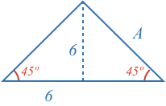
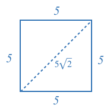
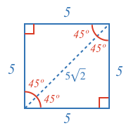

### Example 1

What is the length of side $$A$$?

<hintLow>[Answer]
This triangle is a 45-45-90 triangle, which has the side ratios of:

If we multiply side $$A$$ by $$\sqrt{2}$$ we would get $$10$$.

$$A\sqrt{2} = 10$$

Therefore, the unknown side is:

$$A = \frac{10}{\sqrt{2}} = \bbox[10px,border:1px solid gray]{7.07}$$
</hintLow>

### Example 2

What is the length of side $$A$$?

<hintLow>[Answer]
To solve this problem, it is helpful to know an [[isosceles triangle]]((qr,'Math/Geometry_1/Isosceles/base/Main',#00756F)) has two equal sides and two equal angles.

Looking at the figure, we might see that the left triangle is an isosceles triangle with two sides equal to $$6$$.

This means it has two 45º angles, and as a triangle's angles [[sum to 180º]]((qr,'Math/Geometry_1/Triangles/base/AngleSum',#00756F)), then the third angle must be:

$$180^\circ - 45^\circ - 45^\circ = 90^\circ$$.

This leaves us with:

As the left triangle is a 45-45-90 triangle, its sides will have the ratio:

We can solve for $$B$$:

$$B = 6 \times \sqrt{2} = 8.49$$

The large triangle has two 45º angles and is therefore isosceles. Therefore $$B$$ and $$A$$ are equal:

$$A = B = \bbox[10px,border:1px solid gray]{8.49}$$
</hintLow>

### Example 3

Is this shape a square?

<hintLow>[Answer]
Note that a [[square]]((qr,'Math/Geometry_1/RectanglesAndSquares/base/Square',#00756F)) is a four sided shape whose sides are all equal length, and angles all 90º (right angles).

This shape has four equal sides, but we need to show all the angles are right angles for it to be a square.

First we know a 45-45-90 triangle has side ratios of:

Both triangles have the same side lengths scaled by 5. Therefore, they are [[similar triangles]]((qr,'Math/Geometry_1/SimilarTriangles/base/Main',#00756F)), and share the same angles.

This means we have:

So all the corners are right angles, and the shape is a square.
</hintLow>
