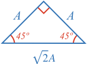

Consider a square split along its diagonal.

We can solve for D using the [[Pythagorean Theorem]]((qr,'Math/Geometry_1/RightAngleTriangles/base/Pythagorus',#00756F)).

$$D^2 = A^2 + A^2$$

$$\sqrt{D^2} = \sqrt{2A^2}$$

$$D = \sqrt{2}A$$

The two other angles of the triangle will be 45º as:
  * It is an [[isosceles triangle]]((qr,'Math/Geometry_1/Isosceles/base/Main',#00756F)) and therefore the angles are equal
  * A triangle's angles [[add to 180º]]((qr,'Math/Geometry_1/Triangles/base/AngleSum',#00756F)), and we know one angle is 90º

Often the $$A$$ is substituted for a $$1$$:

Any time you come accross a right angle triangle with a 45º angle, you will know the proportion of the sides is $$1$$, $$1$$ and $$\sqrt{2}$$.

<!-- ## Pythagorean Theorem

### Example Equation:

$$\definecolor{g}{RGB}{29,177,0}\definecolor{b}{RGB}{0,118,186}\definecolor{r}{RGB}{238,34,12}\definecolor{v}{RGB}{203,41,123}\defineColor{gr}{100,100,100}$$

### Example Image

### Example QR
[[here]]((qr,'Math/Geometry_1/Triangles/base/AngleSumPres',#00756F)) -->