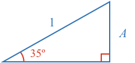
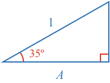
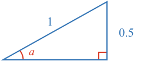
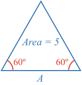

Examples can be computed using a calculator with a sine function or a [[table of sines]]((qr,'Math/Trigonometry_1/Sine/base/TableOfSines',#00756F)).

### Example 1

What is the length of side $$\definecolor{r}{RGB}{238,34,12}\definecolor{b}{RGB}{0,118,186}\color{b}A$$?

<hintLow>[Answer]
Side $$\color{b}A$$ is opposite a known angle in a right angle triangle.

We know:

$$\sin \left( \color{r}angle \color{black} \right) = \frac{\color{b}opposite\color{black}}{\color{b}hypotenuse\color{black}}$$

which can be rearranged to:

$$\color{b}opposite\color{black} = \color{b}hypotenuse\color{black} \times \sin \left( \color{r}angle \color{black} \right)$$

The sine of 35º can be computed with a calculator or [[table of sines]]((qr,'Math/Trigonometry_1/Sine/base/TableOfSines',#00756F)) and is 0.5736.

As the hypotenuse is 1, the opposite side is the same as the sine, thus:

 $$\color{b}A\color{black} = \bbox[10px,border:1px solid gray]{0.5736}$$
</hintLow>

### Example 2

What is the length of side $$\color{b}A$$?

<hintLow>[Answer]
Side $$\color{b}A$$ is opposite a known angle in a right angle triangle.

We know:

$$\color{b}opposite\color{black} = \color{b}hypotenuse\color{black} \times \sin \left( \color{r}angle \color{black} \right)$$

Where the sine of 40º can be computed with a calculator or [[table of sines]]((qr,'Math/Trigonometry_1/Sine/base/TableOfSines',#00756F)) and is 0.6428.

As the hypotenuse is 120, the opposite side is::

 $$\color{b}A\color{black} = 120 \times 0.6428 = \bbox[10px,border:1px solid gray]{77.136}$$
 </hintLow>

### Example 3

What is the length of side $$\color{b}A$$?

<hintLow>[Answer]
Side $$\color{b}A$$ is hypotenuse in a right angle triangle.

We know:

$$\sin \left( \color{r}angle \color{black} \right) = \frac{\color{b}opposite\color{black}}{\color{b}hypotenuse\color{black}}$$

which can be rearranged to:

$$\color{b}hypotenuse\color{black} = \frac{\color{b}opposite\color{black}}{\sin \left( \color{r}angle \color{black} \right)}$$

Where the sine of 60º can be computed with a calculator or [[table of sines]]((qr,'Math/Trigonometry_1/Sine/base/TableOfSines',#00756F)) and is 0.866.

As the opposite side is 2.958, the hypotenuse is:

 $$\color{b}A\color{black} = \frac{2.958}{0.866} = \bbox[10px,border:1px solid gray]{3.415}$$
 </hintLow>

### Example 4

What is the length of side $$\color{b}A$$?

<hintLow>[Answer]
Side $$\color{b}A$$ is adjacent to the known angle, but opposite the unknown angle $$\color{r}a$$.

As angles in a triangle [[add to 180º]]((qr,'Math/Geometry_1/Triangles/base/AngleSumPres',#00756F)) , the unknown angle must be:

$$\color{r}a\color{black} = 180^\circ - 90^\circ - 35^\circ = 55^\circ$$

We know:

$$\color{b}opposite\color{black} = \color{b}hypotenuse\color{black} \times \sin \left( \color{r}angle \color{black} \right)$$

Where the sine of 55º can be computed with a calculator or [[table of sines]]((qr,'Math/Trigonometry_1/Sine/base/TableOfSines',#00756F)) and is 0.8192.

As the hypotenuse is 1, the unknown side is:

 $$\color{b}A\color{black} = 1 \times 0.8192 = \bbox[10px,border:1px solid gray]{0.8192}$$
 </hintLow>

### Example 5

What is the size of angle $$\color{r}a$$ in degrees?

<hintLow>[Answer]
We know

$$\sin \left( \color{r}angle \color{black} \right) = \frac{\color{b}opposite\color{black}}{\color{b}hypotenuse\color{black}}$$

The hypotenuse is 1 and the opposite side is 0.5, therefore the sine of the angle must be:

$$\sin \left( \color{r}angle \color{black} \right) = \frac{0.5}{1} = 0.5$$

We can now reference a [[table of sines]]((qr,'Math/Trigonometry_1/Sine/base/TableOfSines',#00756F)) and see which angle has a sine of 0.5.

The angle 30º has a sine of 0.5, therefore:

 $$\color{r}a\color{black} = \bbox[10px,border:1px solid gray]{30^\circ}$$
 </hintLow>

 ### Example 6

What is the length of side $$\color{b}A$$?

<hintLow>[Answer]
The unknown angle of the triangle must be 60º as all angles in a triangle [[add to 180º]]((qr,'Math/Geometry_1/Triangles/base/AngleSumPres',#00756F)).

Therefore this triangle is an [[equilateral]]((qr,'Math/Geometry_1/Equilateral/base/Main',#00756F)) triangle with all sides being equal.

We also know that the [[area]]((qr,'Math/Geometry_1/AreaTriangle/base/Main',#00756F)) of a triangle is equal to its perpendicular height times its base.

If we draw in the height and equal sides we have:

Here $$\color{b}H$$ is the opposite side to the 60º angle in a right angle triangle.

We know:

$$\color{b}opposite\color{black} = \color{b}hypotenuse\color{black} \times \sin \left( \color{r}angle \color{black} \right)$$

Where the sine of 60º can be computed with a calculator or [[table of sines]]((qr,'Math/Trigonometry_1/Sine/base/TableOfSines',#00756F)) and is 0.866.

Therefore $$\color{b}H$$ is:

$$\color{b}H\color{black} = \color{b}A\color{black} \times 0.866$$

The area of a triangle is:

$$area = \frac{1}{2} height \times base$$

Where the base is $$\color{b}A$$.

Therefore we have:

$$5 = \frac{1}{2} 0.866\color{b}A\color{black}\times\color{b}A$$

$$5 = 0.433\color{b}A\color{black}^2$$

$$\color{b}A\color{black} = \sqrt{\frac{5}{0.2165}} = \bbox[10px,border:1px solid gray]{3.398}$$
 </hintLow>