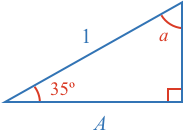

Examples can be computed using a calculator with a sine function or a [[table of sines]]((qr,'Math/Trigonometry_1/Sine/base/TableOfSines',#00756F)).

### Example 1

What is the length of side $$\definecolor{r}{RGB}{238,34,12}\definecolor{b}{RGB}{0,118,186}\color{b}A$$?

<hintLow>[Answer]
Side $$\color{b}A$$ is opposite a known angle in a right angle triangle.

We know:

$$\sin \left( \color{r}angle \color{black} \right) = \frac{\color{b}opposite\color{black}}{\color{b}hypotenuse\color{black}}$$

which can be rearranged to:

$$\color{b}opposite\color{black} = \color{b}hypotenuse\color{black} \times \sin \left( \color{r}angle \color{black} \right)$$

The sine of 35º can be computed with a calculator or [[table of sines]]((qr,'Math/Trigonometry_1/Sine/base/TableOfSines',#00756F)) and is 0.5736.

As the hypotenuse is 1, the opposite side is the same as the sine, thus:

 $$\color{b}A\color{black} = \bbox[10px,border:1px solid gray]{0.5736}$$
</hintLow>

### Example 2

What is the length of side $$\definecolor{r}{RGB}{238,34,12}\definecolor{b}{RGB}{0,118,186}\color{b}A$$?

<hintLow>[Answer]
Side $$\color{b}A$$ is opposite a known angle in a right angle triangle.

We know:

$$\color{b}opposite\color{black} = \color{b}hypotenuse\color{black} \times \sin \left( \color{r}angle \color{black} \right)$$

Where the sine of 40º can be computed with a calculator or [[table of sines]]((qr,'Math/Trigonometry_1/Sine/base/TableOfSines',#00756F)) and is 0.6428.

As the hypotenuse is 120, the opposite side is::

 $$\color{b}A\color{black} = 120 \times 0.6428 = \bbox[10px,border:1px solid gray]{77.136}$$
 </hintLow>

### Example 3

What is the length of side $$\definecolor{r}{RGB}{238,34,12}\definecolor{b}{RGB}{0,118,186}\color{b}A$$?

<hintLow>[Answer]
Side $$\color{b}A$$ is hypotenuse in a right angle triangle.

We know:

$$\sin \left( \color{r}angle \color{black} \right) = \frac{\color{b}opposite\color{black}}{\color{b}hypotenuse\color{black}}$$

which can be rearranged to:

$$\color{b}hypotenuse\color{black} = \frac{\color{b}opposite\color{black}}{\sin \left( \color{r}angle \color{black} \right)}$$

Where the sine of 60º can be computed with a calculator or [[table of sines]]((qr,'Math/Trigonometry_1/Sine/base/TableOfSines',#00756F)) and is 0.866.

As the opposite side is 2.958, the hypotenuse is:

 $$\color{b}A\color{black} = \frac{2.958}{0.866} = \bbox[10px,border:1px solid gray]{3.415}$$
 </hintLow>

 ### Example 4

What is the length of side $$\definecolor{r}{RGB}{238,34,12}\definecolor{b}{RGB}{0,118,186}\color{b}A$$?

<hintLow>[Answer]
Side $$\color{b}A$$ is adjacent to the known angle, but opposite the unknown angle $$\color{r}a$$.

As angles in a triangle add to 180º, the unknown angle must be:

$$\color{r}a\color{black} = 180^\circ - 90^\circ - 35^\circ = 55^\circ$$

We know:

$$\color{b}opposite\color{black} = \color{b}hypotenuse\color{black} \times \sin \left( \color{r}angle \color{black} \right)$$

Where the sine of 55º can be computed with a calculator or [[table of sines]]((qr,'Math/Trigonometry_1/Sine/base/TableOfSines',#00756F)) and is 0.8192.

As the hypotenuse is 1, the unknown side is:

 $$\color{b}A\color{black} = 1 \times 0.8192 = \bbox[10px,border:1px solid gray]{0.8192}$$
 </hintLow>