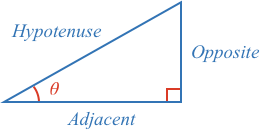

### Similar Triangles

[[Similar triangles]]((qr,'Math/Geometry_1/SimilarTriangles/base/SimilarPres',#00756F)) share the same angles, and have sides that have the same scaling factor.

The symbol "~" denotes that the triangles are similar.

If we look at the ratio of any two corresponding sides (for example $$A$$ and $$B$$), we see the ratio is the same:

$$\frac{sA}{sB} = \frac{s}{s}\times \frac{A}{B} = 1 \times \frac{A}{B} = \frac{A}{B}$$

Similarly:

$$\frac{sA}{sC} = \frac{A}{C}$$

$$\frac{sB}{sC} = \frac{B}{C}$$

In other words, for all similar triangles, the ratio of corresponding sides is constant.

### Right angle triangles

The angles in a triangle [[add to 180º]]((qr,'Math/Geometry_1/Triangles/base/AngleSumPres',#00756F)), so just two angles are needed to know all three. Therefore, any two **right angle triangles** will be **similar** if we know just one angle and the right angle.

Name the sides relative to this known angle $$\theta$$:

We can now say for all right angle triangles with angle $$\theta$$

* the ratio of the opposite side and the hypotenuse will be the same
* the ratio of the adjacent side and the hypotenuse will be the same
* the ratio of the opposite side and the adjacent side will be the same

### Changing Angle

As the angle $$\theta$$ changes, then these ratios change. In other words, these ratios are a function of $$\theta$$

For example:

$$\frac{opposite}{hypotenuse} = function\left(\theta\right)$$

This function has been studied for millennia, and is now called the *sine* function (often abbreviated to *sin*).

$$\frac{opposite}{hypotenuse} = \sin\left(\theta\right)$$

### Sine function value

Calculating the actual value of the sine function can be difficult.

In the first century CE, geometry was used to prove the sines of specific angles. In 1400 CE, a formula was found that precisely calculates the sine of any angle. Both these methods involve calculations that without a calculator can be long and difficult.

$$ \sin\left(\theta\right) = \theta - \frac{\theta^3}{3!} + \frac{\theta^5}{5!} - \frac{\theta^7}{7!} + ...$$

Therefore up until the 20th century, published [[tables]]((qr,'Math/Trigonometry_1/Sine/base/TableOfSines',#00756F)) of sine values for different angles were used until calculators and computers superseded them.

### Use

We now have a relationship between angle and sides of a right angle triangle.

$$\sin\left(\theta\right) = \frac{opposite}{hypotenuse}$$

If you know any two properties, you can calculate the third.

For example, if you know the angle is 70º and the hypotenuse is 2, then you can refer to a [[table of sines]]((qr,'Math/Trigonometry_1/Sine/base/TableOfSines',#00756F)) (or a calculator) to see that:

$$\sin \left(70^\circ\right) = 0.9397$$

and therefore:

$$opposite = hypotenuse \times \sin\left(70^\circ\right) = 2 \times 0.9397 = 1.8794$$

Similarly, if you know the opposite side is 2, and the hypotenuse is 4, then you know:

$$\sin\left(\theta\right) = \frac{2}{4} = 0.5$$

Referring to a [[table of sines]]((qr,'Math/Trigonometry_1/Sine/base/TableOfSines',#00756F)) you can see that the angle with a sine of 0.5 is 30º. Therefore the unknown angle is 30º.

### Remaining ratios

The other ratios of sides have names of cosine (cos) and tangent (tan):

$$\frac{adjacent}{hypotenuse} = \cos\left(\theta\right)$$

$$\frac{opposite}{adjacent} = \tan\left(\theta\right)$$

The sine, cosine and tangent functions are all related and their values can derived from each other. In this learning path we start with the sine funciton, and derive the cosine and tangent functions from it, and so cosine and tangent will be looked at in subsequent topics in this learning path.
