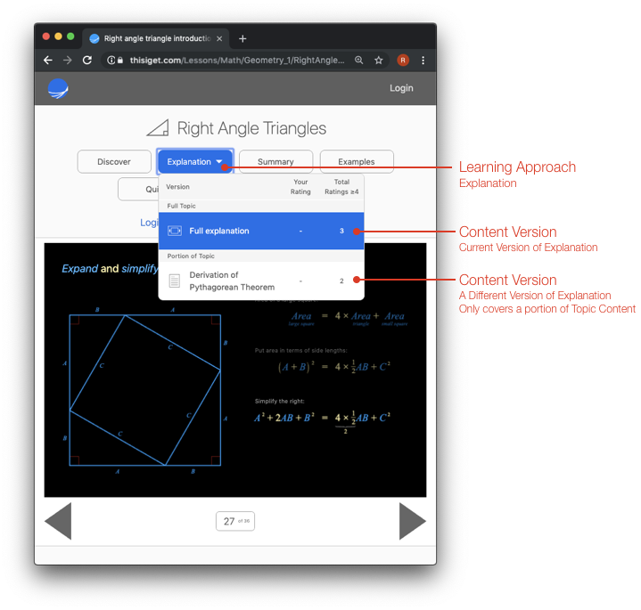
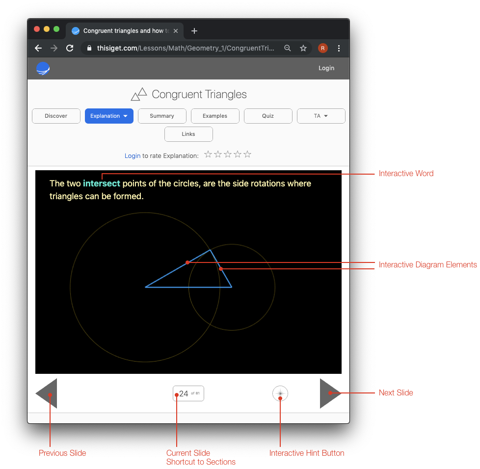
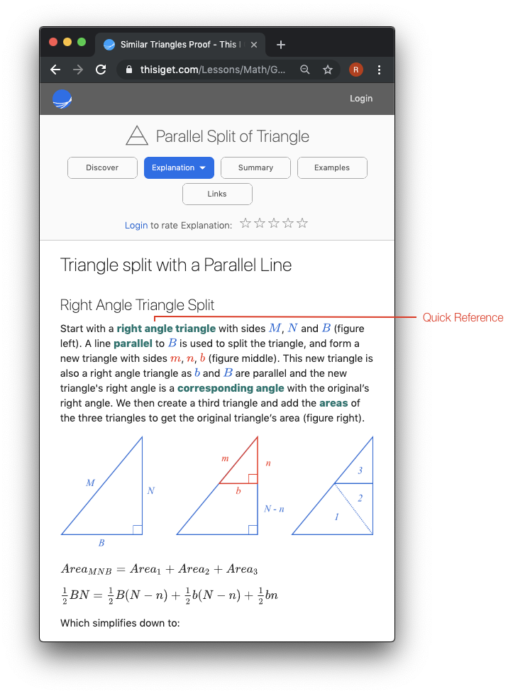

# Introduction

Many sources of information (textbooks, videos, websites) will present content in one way. If the content is not clear for a user, it is up to them to search for other sources of the same information that might be more useful for them.

In contrast, this site tries to present several approaches and versions of the same content to a user, including links to external sources of similar information, so they have a higher chance of succesffully learning what they were seeking. Each version of content and external link can be rated by the users, to further assist them, and others, in more efficiently learning.

This page details the site's terminology and features as a way to introduce what the site is.

## Terminology

Below is a screenshot of a typical page on this site with some areas labeled.

### Topic
A “Topic” is the site’s fundamental unit, and represents a piece of knowledge, a concept or a procedure. It has associated "Content" that describes or uses the knowledge, concept or procedure. The knowledge required to understand a topic, and the desired learnings from having reviewed the topic's content should be well defined.

In the diagram above the selected topic is "Angles at Intersections". The topic covers the concepts of opposite, corresponding, alternate and interior angles. It requires the knowledge of the "Parallel Lines" topic (and other topics before it), and leads to understanding the "Triangles" topic.

### Content Type:
The content of each topic can be covered using different approaches. These approaches are classified into Content Types as:

* Discover - a problem statement is given with progressively more hints to allow the user to discover the content
* Explanation - a complete description of the content
* Summary - what you need to know to move onto the next topic
* Examples - examples showing where and how to use the content
* Quiz - practice using the content
* TA - interactive diagrams that might be useful in a teaching environment
* Links - a selection of external links that also address the same content in different ways or from different perspectives

### Content Version:

There are several ways to describe or present content using the same approach. For instance, an "Explanation" might:

* be described more precisely, or more intuitively
* be described more concisely, or descriptively
* have interactive content or be completely static
* be presented as video, audio, presentation slides or text
* use one line of reasoning or proof, instead of another
* completely cover the topic, or focus just on one area

An example of different versions is below. In this case the topic "Right Angle Triangles" has an "Explanation" with two different versions: "Full Explanation" and "Derivation of Pythagorean Theorm". In this case, the first version covers the entire topic, while the second version focuses on just a portion of the topic.

### Rating:
Each version of content, and external links, can be rated by a user between 1 and 5. The user can use their own judgement when rating content, but one way might be:
* 5 - The content really clicks with the user from start to finish
* 4 - The content is well done, but there a few areas that weren’t clear
* 3 - The content is good, but other versions of it were reviewed/needed to fully get it
* 2 - It is difficult to understand, and doesn’t really work for the user
* 1 - The content was not helpful

Ratings are personal. Some content will get a 5 from some users, and a 1 from other users. Even if content only gets high ratings from a small percentage of users, it is still valuable and appreciated. The fact it helped some people is fantastic, as other more popular versions of the content might not have been helpful for them.

Users can see two ratings for each version of content:
* Their own rating
* The number of people that gave a rating of 4 or 5

The intent here is to celebrate all lessons that help users, and not degrade from those that help only a smal percentage.

Whether this can be realized is not clear, and this will likely be experimented with over time.

### Learning Path:
A learning path is a set of topics that follow each other based on the dependence of their content.

At the start of the path (the first topic) a set of knowledge is assumed. But after that point, each topic covers all knowledge that future topics in the path will require.

## Content Format

There are several ways content is currently formatted on the site.

### Presentation Format

The presentation format allows:
* Gradual introduction of content
* Interactive diagrams whose interactively changes with the slide context
* Equation animation that can show clear progression through equation forms
* Users can progress through the content at their own pace

An example of presentation format is below. Arrows to the side or beneath the content allow for slide to slide navigation. Touching the slide number allows jumping between sections.

Some of the presentation content versions are interactive. Generally text that is bold can be touched that will result in an acation, and sometimes the diagram itself can be manipulated.

Repeated touching of the "Interactive Hint Button" will highlight all the interactive elements on the current slide.

### Single Page Format

The single page format shows all content in a single, scrollable page.

Content is generally not interactive, but some text may be clickable as links or as quick references to other topics.

